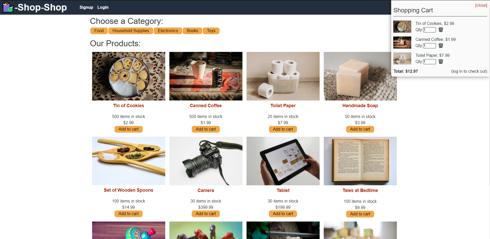

## Links
**Live Deployment:** https://hidden-temple-77331.herokuapp.com/
 
 
**Github Repo:** https://github.com/jwilferd10/Shop-Shop-Redux

**Picture of Deployed Application:**

## Table of Contents 
  - [Description](#description)
  - [User Story](#user-story)
  - [Resources Used](#resources-used)
  - [Installation](#installation)
  - [Usage](#usage)
  - [Contact Information](#contact-information)

## Description:
For this particular challenge I worked on a website called Shop-Shop! The entire purpose was to refactor the pre-existing code to use Redux. This was made possible by using the Redux documentation that step-by-step helped out tremendously in efficiently 'cleaning' up pre-existing code.

## User Story
**AS a senior engineer working on an e-commerce platform**
- I WANT my platform to use Redux to manage global state instead of the Context API
- SO THAT my website's state management is taken out of the React ecosystem

**GIVEN an e-commerce platform that uses Redux to manage global state**
- WHEN I review the app’s store
  - THEN I find that the app uses a Redux store instead of the Context API
- WHEN I review the way the React front end accesses the store
  - THEN I find that the app uses a Redux provider
- WHEN I review the way the app determines changes to its global state
  - THEN I find that the app passes reducers to a Redux store instead of using the Context API
- WHEN I review the way the app extracts state data from the store
  - THEN I find that the app uses Redux instead of the Context API
- WHEN I review the way the app dispatches actions
  - THEN I find that the app uses Redux instead of the Context API

## Resources Used

    Client Resources:
    "@apollo/react-hooks": "^3.1.3",
    "@stripe/stripe-js": "^1.3.1",
    "@testing-library/jest-dom": "^4.2.4",
    "@testing-library/react": "^9.5.0",
    "@testing-library/user-event": "^7.2.1",
    "apollo-boost": "^0.4.7",
    "apollo-link-context": "^1.0.20",
    "graphql": "^14.6.0",
    "graphql-tag": "^2.10.3",
    "jwt-decode": "^2.2.0",
    "react": "^16.13.1",
    "react-dom": "^16.13.1",
    "react-router-dom": "^5.1.2",
    "react-scripts": "3.4.1"

    Server Resources:
    "apollo-server-express": "^2.11.0",
    "bcrypt": "^4.0.1",
    "express": "^4.17.1",
    "graphql": "^15.5.0",
    "jsonwebtoken": "^8.5.1",
    "mongoose": "^5.9.7",
    "stripe": "^8.67.0"

## Installation
Install this project by clicking the *GREEN* button above, you can download it by ZIP or copy the SSH! Then you'll want to run it by doing npm i.

## Usage
Usage is pretty simple, navigate through the web-page as you would any e-commerce website.  
 
Something to note:
- Create an account with more then 5 characters on the password
- Login with email and designated password
## Contact Information
- ### [jwilferd10](https://github.com/jwilferd10)
